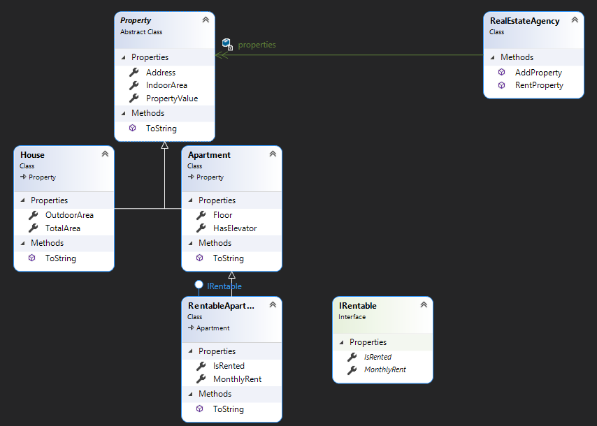

# Lab 4
Object oriented programming

# RealEstateAgency Class

## Description

The `RealEstateAgency` class is responsible for managing various real estate properties. Each property is implemented based on the following class diagram.

Each class in the hierarchy must contain the corresponding properties shown in the diagram and should override the `ToString()` method appropriately.

### Note:
The `TotalArea` property will calculate the sum between `IndoorArea` and `OutdoorArea`.

## Properties

The `RealEstateAgency` class contains a list of properties. This class provides the following methods:

### Methods

- **AddProperty(Property property)**  
  Adds a new property to the list.

- **RentProperty(string adress)**  
  Rents out the property at the given address. (A validation check is required to ensure that the property can be rented.)

## Example Properties

The list of properties must contain at least:
- One house
- One apartment
- One rental apartment
